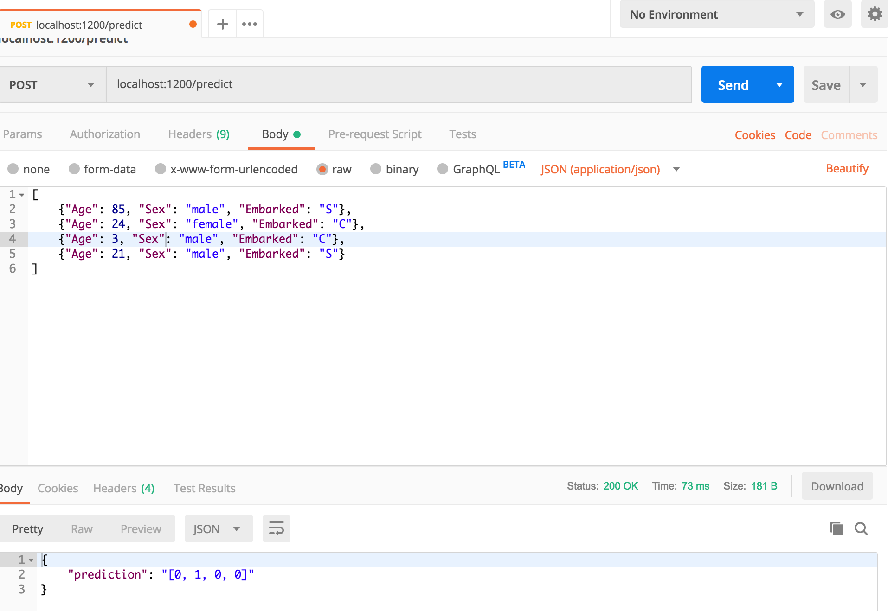

# mlapi
A machine learning API using flask and postman.

Usage:  
python app.py

After you have started the Flask server successfully, you then need to enter the right URL with the correct port number in Postman. It should look similar to the following:
